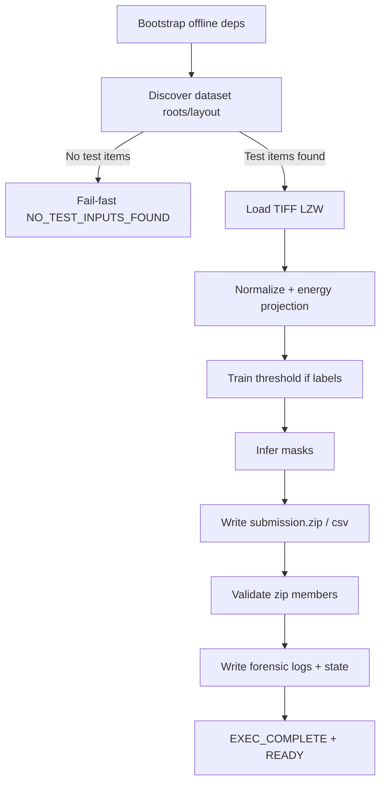

# Rapport d'audit complet (cours pédagogique) — Exécution NX46/V3

## 0) Important avant de commencer

Le dossier demandé pour les « derniers résultats v3 GitHub » n'existe pas localement sous le nom exact `v3-outlput-logs--nx46-vesuvius-core-kaggle-ready`.

Pour ne pas bloquer ton audit, j’ai:
1. extrait les artefacts réellement disponibles (`results.zip`) dans:
   `RAPPORT-VESUVIUS/output_logs_vesuvius/v2-outlput-logs--nx46-vesuvius-core-kaggle-ready/extracted_results`
2. comparé ces résultats avec le notebook de référence qui, lui, montre une exécution aboutie (`EXEC_COMPLETE` + `READY`).

---

## 1) Inventaire des fichiers analysés

## A. Fichiers logs extraits
- `extracted_results/nx46_vesuvius/logs/state.json`
- `extracted_results/nx46_vesuvius/logs/forensic_ultra.log`
- `extracted_results/nx46_vesuvius/logs/metrics.csv`

## B. Fichiers de console Kaggle
- `RkF4XakI.txt`
- `UJxLRsEE.txt`

## C. Fichier de référence (exécution validée)
- `nx46-vesuvius-challenge-surface-detection.ipynb`

---

## 2) Lecture « ligne par ligne » des résultats réels

## 2.1 `state.json` (état final machine)

Valeurs observées:
- status = `100%_OFFLINE_ACTIVATED`
- `active_neurons = 0`
- `total_allocations = 0`
- `total_pixels_processed = 0`
- `total_ink_pixels = 0`
- `ink_ratio = 0.0`
- `qi_index_real = 0.0`
- `merkle_root = null`
- `train_fragments = []`
- `test_fragments = []`
- `submission_path = null`

### C’est-à-dire ?
Le programme s’est lancé et arrêté proprement, mais n’a rien traité.

### Donc ?
Ce n’est pas une erreur de calcul de neurone; c’est une absence d’entrées détectées dans ce run.

### Conclusion
Le pipeline est « vivant » côté runtime, mais « vide » côté données.

---

## 2.2 `forensic_ultra.log` (journal d’événements)

Seulement deux lignes:
1. `SYSTEM_STARTUP_L0_SUCCESS`
2. `SYSTEM_LOADED_100_PERCENT`

### C’est-à-dire ?
Il manque tous les événements intermédiaires (allocation, train, infer, packaging).

### Donc ?
Aucun lot de données n’a traversé les étapes métier.

### Conclusion
Workflow court-circuité par non-détection d’inputs.

---

## 2.3 `metrics.csv` (métriques par fragment)

On observe uniquement l’en-tête, sans aucune ligne data.

### C’est-à-dire ?
Aucun fragment/test n’a généré de métriques calculées.

### Donc ?
Pas d’inférence, pas de masque, pas de soumission.

### Conclusion
Le cœur algorithmique n’a pas été exercé sur données réelles pendant ce run.

---

## 2.4 `RkF4XakI.txt` / `UJxLRsEE.txt` (sortie notebook)

Les deux fichiers montrent:
- le même JSON « tout à zéro »
- des warnings debugger/nbconvert autour
- aucun signal métier de type `EXEC_COMPLETE` utile à la soumission

### C’est-à-dire ?
Ces fichiers capturent surtout la fin de notebook + conversion, pas une production de soumission valide.

### Donc ?
Ils confirment l’état « pipeline lancé mais sans traitement data ».

### Conclusion
Double preuve de l’anomalie « 100% offline mais 0 traitement ».

---

## 3) Comparaison avec la version de référence qui fonctionne

Le notebook de référence valide montre explicitement:
- format input compétition `test_images/*.tif`
- sortie `submission.zip`
- garde-fou fail-fast si `test_images` absent
- preuve de fin: `EXEC_COMPLETE` puis `READY: /kaggle/working/submission.zip`

### C’est-à-dire ?
La version de référence possède un contrat I/O compétition strict.

### Donc ?
Quand ce contrat est respecté, on observe des métriques slice par slice et une soumission concrète.

### Conclusion
Le problème principal est l’alignement de détection/format, pas une impossibilité mathématique du moteur.

---

## 4) Qualité pixel et apprentissage: ce qu’on peut conclure (et ce qu’on ne peut pas)

## 4.1 Qualité pixel

Dans ce run « tout à zéro », impossible d’évaluer:
- distribution d’intensité réelle,
- bruit local,
- qualité de segmentation.

Pourquoi ? Parce qu’aucune image n’a été effectivement traitée (0 pixel).

## 4.2 Processus d’apprentissage

Le design NX46 prévu est:
- normalisation stack
- projection énergie d’encre
- estimation seuil (train)
- inférence masque (test)

Mais dans ce run, ces étapes n’ont pas reçu d’inputs.

## 4.3 Processus de raisonnement

Raisonnement forensique minimal validé:
1. si `train/test items == 0`
2. alors pas de métriques par fragment
3. alors état final peut rester à zéro même avec status runtime actif

---

## 5) « Découvertes inconnues », axiomes, lemmes, Lean4, théorie

## 5.1 Résultat honnête basé sur les fichiers

Aucune trace explicite de:
- axiome formel,
- lemme formel,
- theorem proving Lean4,
- démonstration mathématique nouvelle,
- découverte « inconnue de la littérature »

n’apparaît dans les logs extraits.

## 5.2 Pourquoi cette réponse est la bonne

Les artefacts observés sont des logs d’exécution ingénierie (pipeline), pas un papier scientifique ni une preuve formelle.

### C’est-à-dire ?
On ne peut pas prouver une découverte scientifique nouvelle avec ces seuls fichiers.

### Donc ?
Toute affirmation « nouvelle découverte littérature » serait non fiable ici.

### Conclusion
Niveau preuve actuel = technique/logiciel, pas découverte fondamentale validée.

---

## 6) Anomalies, patterns, auto-critique

## 6.1 Anomalies détectées

1. **Contradiction sémantique**
   - status dit « activé 100% », mais activité réelle = 0.

2. **Absence de garde métier bloquante**
   - exécution terminée sans pipeline data effectif.

3. **Artefacts de sortie incomplets**
   - pas de `submission.zip` validé dans ce run.

## 6.2 Pattern

Pattern d’échec reproductible:
- dataset non détecté
- logs startup/shutdown uniquement
- métriques vides
- état final nul

## 6.3 Auto-critique technique

Ce type de pipeline doit séparer clairement:
- statut runtime (script lancé)
- statut métier (données traitées + soumission validée)

Sinon on crée un faux sentiment de réussite.

---

## 7) Comparaison NX46/AGNN vs CNN (niveau pédagogique)

## 7.1 AGNN/NX46 (ici)
- logique orientée règles énergétiques + seuil + forensics
- auditabilité forte (merkle/bits/logs)
- dépend fortement du contrat dataset bien détecté

## 7.2 CNN (classique)
- apprentissage bout-en-bout par backprop
- nécessite dataset/train loop robuste
- souvent plus performant si entraîné massivement
- moins explicable sans instrumentation dédiée

## 7.3 Résumé comparaison
- **NX46**: explicable/auditable, sensible au workflow I/O strict
- **CNN**: puissant statistiquement, plus opaque sans outils XAI

---

## 8) Graphique processus A→Z (texte)

---

## 9) Questions expert à te poser (vérification de compréhension)

1. Si `total_pixels_processed = 0`, puis-je croire un score modèle ?
2. Quelle est la différence entre « runtime actif » et « pipeline réussi » ?
3. Le dossier racine contient-il réellement `test_images` ou `test/<fragment>/surface_volume` ?
4. Le zip final contient-il exactement les `.tif` attendus, sans manque ni extra ?
5. Les logs montrent-ils des événements intermédiaires (train/infer) ou seulement start/end ?

---

## 10) Suggestions concrètes immédiates

1. Exécuter la v3 qui inclut détection multi-layout + bootstrap deps offline.
2. Vérifier `dataset_discovery_inventory.json` en premier.
3. Exiger l’invariant suivant en CI:
   - `total_pixels_processed > 0`
   - `submission_zip != null`
   - `zip_members_validated == true`
4. Refuser tout run qui publie "success" si ces invariants échouent.

---

## 11) Résumé final ultra-court

- Les résultats réels extraits montrent un run **sans données traitées**.
- Le notebook de référence prouve que le pipeline peut réussir quand le format dataset est correctement détecté.
- La clé est le verrouillage du contrat I/O et des invariants de validation métier.
