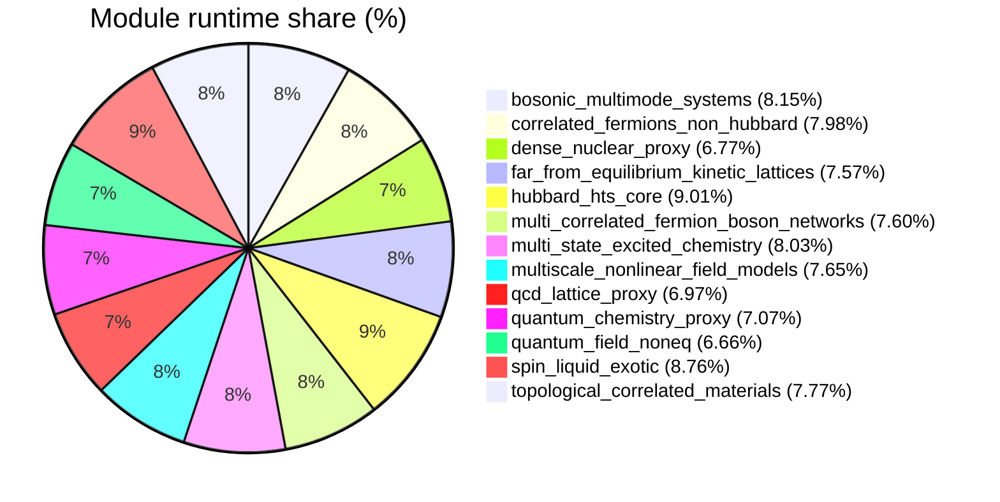

# Low-level Telemetry (module/hardware/interoperability)

- total_runtime_ns: `15713315230`
- total_qubits_simulated_proxy: `1160`
- avg_cpu_percent_global: `17.40`
- avg_mem_percent_global: `60.07`

## Architecture (mode FULL V4 NEXT)

```mermaid
flowchart LR
  A[run_research_cycle.sh] --> B[metadata_capture]
  B --> C[cycle_guard]
  C --> D[physics_readiness_pack]
  D --> E[v4next_integration_status]
  E --> F[v4next_rollout_controller full]
  F --> G[v4next_rollout_progress]
  G --> H[v4next_realtime_evolution]
  H --> I[chatgpt_critical_tests]
  I --> J[authenticity_audit]
  J --> K[checksums/audit]
```

## Module runtime share

